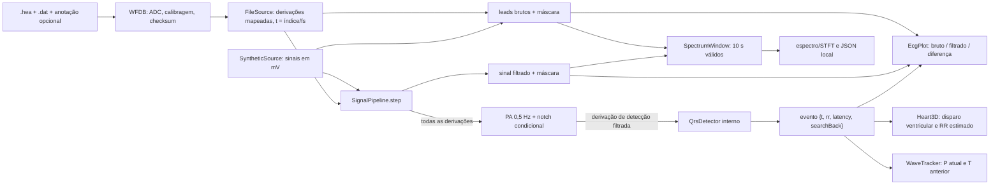

# 06 — Diagnóstico de arquitetura e observabilidade

**Vínculo:** [SDD 002](../specs/002-consolidacao-base-ecg-3d.md), B01; [protocolo](01-arquitetura-observabilidade.md).

**Data:** 2026-10-08. **Estado:** concluído, somente auditoria de código e execução Node local.

**Escopo:** arquitetura, contratos e instrumentação do fluxo atual; sem mudanças de produção, de algoritmos ou dos gates. B02 (inventário) é trabalho separado.

## Resultado executivo

O caminho executado é único no núcleo: `loadRecord`/`FileSource` fornecem amostras físicas na frequência nativa; `SignalPipeline.step` filtra todas as derivações, preserva a máscara de lacunas e encaminha somente a derivação de detecção filtrada ao QRS. A interface chama esse mesmo passo; `detectAll` o usa no lote. No LUDB 8 local, os 12 checksums passaram e a execução produziu eventos com instante do pico estimado distinto do instante de emissão. A fonte sintética seeded também executou esse passo.

Três limites impedem tratar esses fatos como garantia geral: checksums falsos são reportados, mas não bloqueiam processamento; unidades não reconhecidas seguem sem conversão para filtros/detector (embora a interface avise); e o export espectral não registra a cadeia interna/versão do detector nem seus eventos. O 3D recebe somente eventos QRS; P/T não o comandam. A pausa/velocidade usam o relógio de amostras emulado por `requestAnimationFrame`, mas a integração gráfica e o modelo anatômico não foram executados manualmente nesta auditoria. Nenhuma métrica de memória, CPU ou renderização foi coletada (B04).

## Fluxo e relógios observados



Há quatro coordenadas que não devem ser confundidas:

1. **Amostra/sinal:** `FileSource.next()` fornece `t = index / fs`; não reamostra nem aplica `baseTime`/`baseDate` do cabeçalho ao relógio relativo.
2. **Pico do evento:** `event.t` é o pico estimado, corrigido pelo atraso de grupo do passa-baixa interno do detector; não é uma anotação nem o instante em que o detector terminou a decisão.
3. **Emissão:** `event.latency = nowT - event.t`; `nowT` é o tempo da amostra que fecha a candidata ou dispara search-back. Search-back pode produzir atraso maior.
4. **Animação:** `main.js` inicia a sístole em `s.t` (emissão observada) e passa `event.t` separadamente como referência retrospectiva para prever o próximo ciclo. O `Heart3D.update` recebe `state.signalTime`, não o relógio de parede.

### Contratos por estágio

| Estágio e evidência | Entrada → saída / unidades | Frequência e relógio | Estado, lacunas e falhas |
|---|---|---|---|
| Cabeçalho WFDB — [`parseHeader`/`parseSignalLine`](../../web/src/io/wfdb.js#L46) | Texto `.hea` → número de sinais, `fs`, contagem, formato, ganho, baseline, unidade declarada, checksum e rótulo do canal. Não lê/valida aqui os bytes do sinal. | Usa `fs` declarado; `fs` ausente assume 250 Hz e contagem ausente/zero faz o decoder inferir do fluxo. Multi-segmento e `samplesPerFrame != 1` são rejeitados. | Formatos suportados: 16, 24, 32, 61, 80, 160 e 212. Cabeçalho vazio, linha inválida ou formato não suportado lança erro. |
| Decodificação/calibração — [`decodeSignals`](../../web/src/io/wfdb.js#L170), [`verifyChecksums`](../../web/src/io/wfdb.js#L229) | Bytes ADC → `Int32Array` ADC e `Float32Array` físico por sinal. Escala física é `(ADC - baseline) / gain × fator(unidade→mV)`; sentinela vira `NaN`. Unidades conhecidas incluem mV, µV/uV, V e nV. Unidade desconhecida usa fator 1, retém rótulo e `known:false`. | Preserva o número de amostras/`fs`; aplica skew para alinhar saída. Checksum WFDB é soma modular de 16 bits sobre valores armazenados, antes do skew. | Arquivo ausente lança erro. Checksum retorna `true`/`false`/`null`; divergência não lança nem interrompe a carga. Skew além do fluxo vira sentinela. `loadRecord` agrega missing e devolve as flags sem impor gate. |
| Mapeamento/fonte — [`mapSignalsToLeads`, `FileSource`](../../web/src/io/fileSource.js#L14) | Sinais físicos + descrições → vetor de 12 derivações por amostra. Aliases incluem MLII→II e C1–C6→V1–V6; se nenhum rótulo é reconhecido, coloca sinais genéricos em ordem. Derivações sem fonte ficam zero e `available:false`. | `fs = record.header.fs`, `t = index/fs`, `position = index/fs`; índice local começa em zero. Derivação de detecção é II se reconhecida, senão a primeira disponível. Sem reamostragem. | Para uma amostra `NaN`, repete o último valor em `leads` para consumidores que não respeitem a máscara, mas marca `missingLeads`; contador cresce por amostra inválida/canal. `reset()` zera índice e valores retidos. |
| Filtros de exibição — [`LeadFilterBank`](../../web/src/ecg/filters.js#L51) | Vetor de derivações físicas → `Float32Array` filtrada por canal. Cadeia atual: passa-alta de primeira ordem 0,5 Hz, seguida de notch biquad Q=30 quando solicitado e `notchHz < fs/2`. | Por amostra e na `fs` nativa; sem deslocar o relógio. Configuração padrão do banco é 60 Hz; registros do manifesto fornecem configuração de rede (LUDB 50 Hz). | Máscara impede avanço do estado e repete saída anterior. Na primeira amostra válida, cadeia é rearmada no valor novo para evitar transiente; notch impossível é omitido e descrito. Erro de coeficiente do notch é explícito. O canal bruto continua separado. |
| Detector QRS — [`QrsDetector.process`](../../web/src/ecg/detector.js#L13) | Uma amostra filtrada da derivação escolhida → `null` ou `{ t, rr, latency, searchBack }`; valores/limiares são relativos à unidade/amplitude de entrada. | Todos os comprimentos são arredondados de segundos × `fs`; saída `t` e `latency` em segundos. Não consulta anotação nem fonte de verdade sintética. | Transformação interna: médias móveis de 30 ms e 150 ms (diferença passa-faixa), diferença atrasada, quadrado e integração móvel de 100 ms; aprendizagem inicial de 1 s, limiar adaptativo, limiar parcial/candidata até 120 ms, refratário 220 ms e busca de pico absoluto no passa-faixa. `derivLag = round(.01 fs)`, mas o histórico tem `derivLag + 1` posições e a comparação reutiliza a posição circular; o lookback efetivo é esse comprimento (6 amostras/12 ms a 500 Hz), não exatamente 10 ms. Candidata forte emite ao fechar; fraca vira reserva e pode emitir depois de 1,66 × RR médio. O atraso de grupo do passa-curta é subtraído de `t`; RR através de lacuna vira `null`. |
| Orquestração — [`SignalPipeline.step`, `detectAll`, `filterAll`](../../web/src/ecg/pipeline.js#L16) | `{t, leads, missing?, missingLeads?}` → `{filtered, mask, event}`. Filtra todas as derivações; só a derivação filtrada selecionada entra no QRS. Interface chama `step`; modo lote repete-o em `detectAll`; `filterAll` acumula filtrado para delineação em lote (consumido em [`wave-eval.mjs`](../../web/tests/wave-eval.mjs#L26)). | A fonte dita `fs` e `t`; os caminhos online/lote usam o mesmo passo. | Primeira amostra inválida da derivação de detecção chama `notifyGap` uma vez: fecha candidata aberta (pode emitir), elimina reserva/search-back, não decide durante a lacuna e rearma memórias do detector na retomada. Os limiares adaptativos são mantidos. Testes demonstram paridade passo-a-passo/lote e recuperação sintética; ver abaixo. |
| Ondas P/T — [`delineatePair`, `delineateWaves`, `WaveTracker`](../../web/src/ecg/waves.js#L115) | Filtrado de uma derivação em unidade física conhecida + R estimados → contornos/ápices QRS, P e T ou `null`; streaming converte posições para amostras atrás do passo atual. Delineação em lote usa índices absolutos. | Frequência nativa, todas as posições em amostras; janela circular streaming padrão de 4 s. | Cada QRS disponível permite estimar P atual e T do batimento anterior; T do último R requer o próximo QRS. `NaN` em qualquer trecho usado invalida o par sem fabricar onda. `buildPipeline` cria/resetta o tracker ao trocar/reiniciar fonte. Os marcadores são visuais, não entradas do 3D. |
| ECG e espectro — [`EcgPlot`](../../web/src/view/ecgPlot.js#L29), [`SpectrumWindow`](../../web/src/ecg/spectrum.js#L170) | Plot retém bruto + filtrado; modos selecionam bruto, filtrado ou `bruto − filtrado`. Espectro calcula bruto, filtrado e diferença do mesmo trecho. | Plot: ring de 2,5 s por derivação e 10 s da tira; escala fixa declarada 25 mm/s e 10 mm/mV. Espectro: janela circular de 10 s/`fs`; STFT padrão 2 s, avanço 1 s. | `NaN`/máscara abre vão no traçado. Lacuna na derivação de detecção zera a janela espectral contínua; só volta a ficar disponível após 10 s válidos. FFT Hann, sem remoção de DC, amplitude unilateral, zero-padding para potência de 2. |
| Exportação — [`safeSpectrumMetadata`, `serializeSpectrumExport`](../../web/src/io/spectrumExport.js#L28) | JSON versionado com espectros/bandas e STFT opcional; não inclui amostras ECG. Metadados allowlisted: origem, ID apenas de catálogo público, derivações/alias permitido, unidade, `fs`, índices/tempos da janela e parâmetros dos filtros. | Índices absolutos do fluxo para janela, segundos relativos/absolutos para STFT. | Rejeita janela/arrays/espectros desalinhados ou não finitos. Origem local não vira caminho/nome de arquivo; unidade fora da allowlist sai como `unknown`. Exportação é download local, sem API. Não registra checksum, hash da fonte, parâmetros internos/estado/versão do detector nem eventos/latências. |
| Coração procedural/anatômico — [`Heart3D.onQrs/update`](../../web/src/view/heart3d.js#L390), chamada em [`main.js`](../../web/src/main.js#L426) | Evento de QRS recebido ao declarar (`tDetected=s.t`) + `tR=event.t` estimado e RR médio → envelope de animação e rótulo didático. Nenhum sinal ou marcador P/T é passado ao `Heart3D`. | `update(state.signalTime)` no relógio relativo às amostras. Procedural altera escala/realce; modelo opcional posiciona clipes/fallbacks manualmente pelos mesmos envelopes. | Reset apaga histórico ao reconstruir pipeline. Átrio é estimado por RR a partir do R estimado; não é P medido nem medida mecânica. O carregador pode usar asset anatômico cifrado, mas o conteúdo privado não foi lido nem decifrado nesta auditoria. |

## Controles, UI e limites de observação

- **Pausa/velocidade:** o callback calcula `dtReal` monotônico, limitado a 100 ms; acumula `dtReal × speed` e avança inteiros `fs` amostras. Pausar suspende `step`, não congela o navegador: plot, espectro, labels e `heart.update` continuam sendo redesenhados no último `signalTime`. Trocar velocidade altera a cadência de reprodução, não a `fs` nem o eixo do registro.
- **Troca/reinício:** selecionar fonte chama `useSynthetic`/`useRecord` e `buildPipeline`, que reconstrói filtros, detector, plot, WaveTracker, janela espectral e Heart3D. Fim de registro fecha o escore e reinicia a fonte/pipeline. Alterar notch reinicia a fonte se o modo é arquivo e sempre reconstrói o pipeline; no modo sintético, o gerador não é reiniciado, mas filtros/detector/plot/análise/heart são.
- **Plot:** guarda bruto e filtrado no mesmo índice; os modos são aplicados durante desenho. “Bruto” é o sinal físico calibrado antes dos filtros deste software, não o ADC inteiro nem uma afirmação de ausência de pré-filtro no equipamento. Os vãos usam `NaN`; QRS, referência e P/T são marcadores distintos. A escala é fixa em mV mesmo quando uma entrada tem unidade desconhecida.
- **Integridade observável:** painel de registro exibe flags do checksum por canal e avisa sobre unidade desconhecida e amostras ausentes. Isso melhora a observabilidade, mas não impede uso de dados cujo checksum falhou nem impede que sinal de unidade desconhecida continue pelo detector.
- **Espectro/export:** só janela contínua válida de 10 s. Exibição indica filtro/`fs`, método FFT e unidade; JSON local não inclui amostras. A unidade declarada pode ser conservada no rótulo de tela mas é normalizada para `unknown` no JSON quando não pertence à allowlist.
- **Modelo 3D:** fonte procedural é padrão; o código distingue label procedural do modelo anatômico ilustrativo e posiciona clipes pelo relógio do sinal, nunca por autoplay. A trilha de integração foi lida no código, não validada num navegador, WebGL ou runtime do asset.

## Reprodução e evidência de execução

Executado em Windows, dentro de `web`, com Node v24.13.0. O replay real lê somente arquivos já incluídos no repositório; não faz download ou chamadas externas. O trecho abaixo usa os mesmos `loadRecord`, `FileSource` e `SignalPipeline.step` do produto. A segunda metade usa uma fonte seeded finita, avançada explicitamente por 5.000 amostras.

```powershell
Set-Location .\web
@'
import { readFile } from "node:fs/promises";
import path from "node:path";
import { loadRecord } from "./src/io/wfdb.js";
import { FileSource } from "./src/io/fileSource.js";
import { SignalPipeline } from "./src/ecg/pipeline.js";
import { SyntheticSource } from "./src/ecg/synth.js";
import { LEAD_NAMES } from "./src/ecg/leads.js";
const manifest = JSON.parse(await readFile("./data/manifest.json", "utf8"));
const e = manifest.records.find((r) => r.id === "ludb/8");
const files = {};
for (const f of e.files.filter((f) => !f.endsWith(".hea"))) {
  const b = await readFile(path.join("data", "records", e.db, f));
  files[f] = b.buffer.slice(b.byteOffset, b.byteOffset + b.byteLength);
}
const rec = loadRecord({ headerText: await readFile(path.join("data", "records", e.db, "8.hea"), "utf8"), files, annotations: files[e.annotations] });
const src = new FileSource(rec);
const p = new SignalPipeline(src.fs, LEAD_NAMES.length, { notchHz: manifest.databases[e.db].mainsHz, detectionLead: src.detectionLead });
const real = [];
while (!src.done) { const s = src.next(); const { event } = p.step(s); if (event) real.push({ t: event.t, emittedAt: s.t, latencyMs: Math.round(event.latency * 1000), searchBack: event.searchBack }); }
const ii = src.mapping[src.detectionLead];
console.log(JSON.stringify({ record: e.id, fs: src.fs, n: rec.nSamples, lead: LEAD_NAMES[src.detectionLead], checksums: rec.checksums, firstADC: rec.adc[ii][0], firstPhysical: rec.signals[ii][0], notchActive: p.filters.notchActive, refs: rec.beats.slice(0, 5).map((i) => i / src.fs), detections: real.length, first: real.slice(0, 5) }, null, 2));
const syn = new SyntheticSource({ fs: 500, seed: 20261008 });
syn.setParams({ hr: 72, hrvPct: 4, noiseMv: 0.03, mainsMv: 0.05, mainsHz: 50 });
const sp = new SignalPipeline(500, LEAD_NAMES.length, { notchHz: 50, detectionLead: LEAD_NAMES.indexOf("II") });
const simulated = [];
for (let i = 0; i < 5000; i++) { const s = syn.next(); const { event } = sp.step(s); if (event) simulated.push({ t: event.t, emittedAt: s.t, latencyMs: Math.round(event.latency * 1000) }); }
console.log(JSON.stringify({ synthetic: "seed=20261008", fs: 500, n: 5000, detections: simulated.length, first: simulated.slice(0, 5) }, null, 2));
'@ | node --input-type=module
```

**Saída conferida:** LUDB `8`, 500 Hz, 5.000 amostras/10 s, derivação de detecção II (sinal 1), 12/12 checksums `true`, primeira ADC de II 147 e primeira amostra física 0,128432 mV. As cinco primeiras referências são 1,360; 2,196; 2,922; 3,732; 4,624 s. O passo online gerou 11 eventos; os cinco primeiros `t` estimados foram 1,396; 2,230; 2,924; 3,734; 4,622 s, emitidos em 1,504; 2,338; 3,048; 3,858; 4,756 s (latências 108, 108, 124, 124, 134 ms; todos `searchBack:false`). A fonte sintética seeded avançada por 10 s gerou 11 eventos; os três primeiros foram `t` 1,230/2,080/2,908 s e emissão 1,356/2,206/3,034 s (126 ms). Esta amostra demonstra o contrato e a diferença entre relógios; não é uma estimativa de desempenho ou acurácia.

**Comandos de teste focado, executados em `web`:**

```powershell
node --test tests/wfdb.test.mjs tests/filters.test.mjs tests/gaps.test.mjs tests/waves.test.mjs tests/spectrum.test.mjs tests/spectrum-export.test.mjs tests/spectrum-plot.test.mjs tests/source-controls.test.mjs
```

Resultado: 158 testes passaram, 0 falharam, 0 ignorados. Evidências direcionadas: [`wfdb.test.mjs`](../../web/tests/wfdb.test.mjs#L97) (checksum/skew), [unidades](../../web/tests/wfdb.test.mjs#L156), [arquivos locais](../../web/tests/wfdb.test.mjs#L286), [lacuna e retomada](../../web/tests/gaps.test.mjs#L86), [paridade interface/lote](../../web/tests/gaps.test.mjs#L143), [streaming/lote P/T](../../web/tests/waves.test.mjs#L73), [espectro com lacuna](../../web/tests/spectrum.test.mjs#L55) e [export/pausa/modos/reset em VM](../../web/tests/spectrum-export.test.mjs#L196). Os testes incluem checksums/amostras iniciais dos registros locais, decodificação/calibração/skew/sentinelas, filtros e notch, lacuna sintética II de 3 s com deslocamento DC opcional, paridade `SignalPipeline.step`/`detectAll`, streaming/lote P/T, invalidar janela espectral e integração de exportação/controles em VM. A VM substitui views e não comprova renderização real no navegador. Não foi executado o comando amplo `npm test` (inclui baterias de benchmark/QRS); não foi medido custo.

### Demonstração de lacuna coberta por teste

`tests/gaps.test.mjs` gera uma fonte sintética, materializa 40 s em 12 derivações, substitui II por `NaN` entre 15–18 s e opcionalmente soma +1,5 mV após a retomada. O caminho atual passa por `FileSource`/`SignalPipeline`; a asserção verifica nenhuma detecção durante a lacuna, nenhuma detecção espúria nos primeiros 300 ms da retomada e ausência de RR de 3 s. Um caso de controle confirma que o fluxo antigo sample-and-hold sem máscara detectava falso positivo na retomada. É uma prova sintética e delimitada, não cobertura de todos os padrões WFDB ou falhas de hardware.

## Matriz de aceite transversal (R01–R08)

| Requisito | Estado B01 | Evidência e limite |
|---|---|---|
| R01 — preservar entrada/proveniência | **Parcial** | ADC, unidade declarada, fator, checksums, máscara e mapeamento são recuperáveis; LUDB 8 foi verificado no replay. Checksum `false` não bloqueia a análise, unidade desconhecida também segue no detector e não há hash obrigatório da fonte. B02 fará inventário/proveniência ampla. |
| R02 — explicar transformações | **Parcial** | Cadeias de filtro/QRS e configurações de exibição estão no código; export registra filtros. O snapshot exportado não registra build/versão do pipeline, parâmetros internos do detector, adaptação de limiar ou por-evento (pico/emissão/latência). |
| R03 — não fabricar dados | **Parcial** | Sentinela → `NaN` + máscara; filtro/detector não avançam na lacuna; teste sintético demonstra fechamento/retomada; plot abre vão e espectro espera 10 s válidos. Não cobre todas as corrupções de arquivo/clock nem garante gate para fonte de escala incompatível. |
| R04 — reproduzir análise | **Parcial** | Os comandos acima reproduzem uma amostra pública local, um synthetic seeded e os testes Node. O repositório registra saída deste caso neste relatório, mas não persiste hash de entrada, ambiente completo ou log machine-readable por execução. |
| R05 — preservar sincronização | **Parcial** | Código separa `s.t`, `event.t`, emissão/latência e relógio animado; testes Node cobrem gaps/restart e integração mocked de pause/modos/reset. Nenhuma validação manual de pausa, velocidade, troca de fonte/notch ou alinhamento do WebGL foi feita em browser. |
| R06 — medir antes de otimizar | **Não medido (B04)** | Nenhum baseline de CPU, memória, custo por amostra, atraso de frame ou export foi produzido nesta auditoria. |
| R07 — separar avaliação | **Não medido (B02)** | Não foi inventariado o histórico de inspeção nem reavaliada a separação por pessoa/sessão/reserva. O replay de LUDB 8 é demonstração de caminho, não alegação de split independente. |
| R08 — não extrapolar o 3D | **Parcial** | Wiring confirma QRS→envelope ilustrativo e RR→previsão atrial; P/T só chegam ao plot, não ao `Heart3D`. Labels e seleção dos modos constam do código; nenhum navegador/asset anatômico foi executado e nenhuma relação eletromecânica foi validada. |

## Lacunas priorizadas e encaminhamento

Prioridades são de integridade/observabilidade/custo do SDD 002, não severidade de vulnerabilidade.

| Prioridade | Achado demonstrável | Tratamento/limite |
|---|---|---|
| **P0 — integridade/calibração/relógios** | `loadRecord` conserva `checksums:false` como dado consultável, mas `useRecord` não interrompe playback; UI apenas escreve `FALHA`. Unidade desconhecida recebe fator 1 e percorre filtro/detector, apesar de escala mV fixa no plot e limiares de onda em mV. Relógio de replay é relativo ao índice e ignora `baseTime/baseDate`; checksum `null` significa ausência de referência, não sucesso verificado. | Definir gate/aviso inequívoco, política de escala e representação do clock em B05 após critérios de B02–B04. Não corrigido em B01. |
| **P1 — observabilidade/reprodução** | UI mostra filtro efetivo, rede/notch e indicadores de arquivo; export é minimizado e limitado a espectro. Faltam versão/configuração efetiva do detector, proveniência/hash do dado local e trilha de evento (`t` estimado, `t` emitido, latência, `searchBack`), assim como registro explícito de pausa/reinício. | B01 registra a lacuna e o contrato. Definir allowlist/necessidade antes de instrumentar, sem exportar cabeçalho livre ou sinal bruto. |
| **P2 — custo** | Rings do ECG, WaveTracker, SpectrumWindow e vetores FFT existem, mas não há medida de alocação/uso total, tempo de `step`, desenho ou geração do JSON por `fs`/número de canais. A reprodução Node e os testes funcionais não são benchmark de UI. | Medir com ambiente/carga/protocolo previamente fixados em B04 antes de mudar buffers/renderização. |

## Fora do que foi verificado

Não foi aberta a UI no navegador, nem exercitado WebGL/animação manualmente; os testes de controles rodam em VM com views simuladas. Não foi lido/decriptado conteúdo de asset privado. Não foram chamadas APIs externas, baixados dados, medidos benchmarks ou avaliadas todas as entradas do manifesto. O resultado conclui B01 com evidências limitadas ao código, aos testes listados e às duas reproduções citadas; não certifica validação clínica, desempenho, consistência total da base ou conformidade regulatória.
